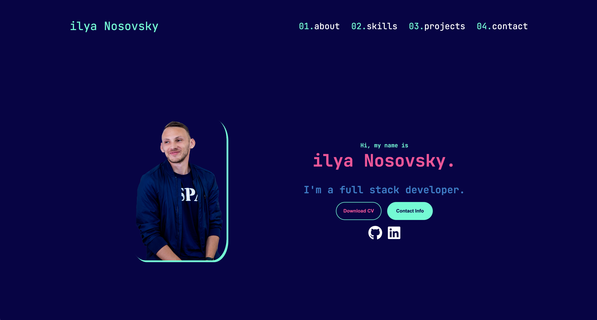
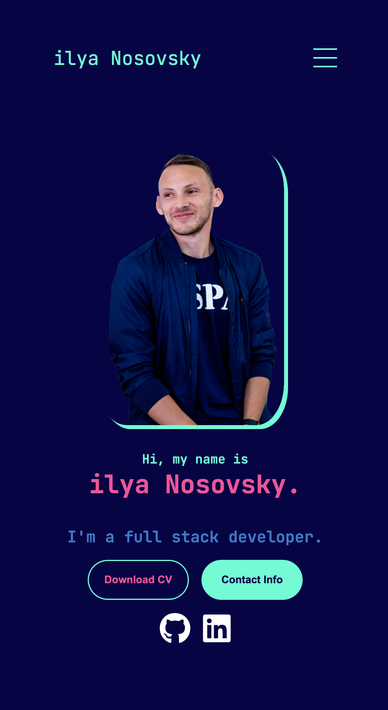

# My Personal Portfolio Website

Welcome to my personal portfolio website! This repository contains the code for my fully responsive portfolio website. The website is built using HTML, CSS, and JavaScript for the navigation functionality. It's deployed using [Netlify](https://www.netlify.com/) and showcases my skills, projects, and experiences.

## Table of Contents

- [Introduction](#introduction)
- [Features](#features)
- [Screenshots](#screenshots)
- [Technologies Used](#technologies-used)
- [Deployment](#deployment)
- [Usage](#usage)
- [Contact](#contact)
- [License](#license)

## Introduction

This portfolio website serves as a platform to present my background, skills, projects, and ways to get in touch with me. Whether you're interested in my work or just want to connect, I hope you find it informative and engaging.

## Features

- **Responsive Design**: The website is designed to work seamlessly across various devices and screen sizes.
- **Navigation**: The navigation bar enhances user experience by allowing easy access to different sections of the website.
- **About Me**: Learn a bit about me, my background, and my aspirations.
- **Skills and Experience**: Discover the skills I've acquired and my professional journey.
- **Projects Showcase**: Explore the projects I've worked on, complete with descriptions and links.
- **Contact Information**: Reach out to me via email or LinkedIn to connect.
- **Download CV**: You can download my CV directly from the website.

## Screenshots

### Desktop Version

### Mobile Version

## Technologies Used

- HTML
- CSS
- JavaScript (for navigation functionality)
- Media Queries (for responsive design)
- [Netlify](https://www.netlify.com/) (for deployment)

## Deployment

The website is deployed using Netlify. You can visit the live website by clicking [here](https://ilyanosovsky.netlify.app/).

## Usage

To explore the code, make modifications, and customize the content, follow these steps:

1. Clone this repository: `git clone https://github.com/ilyanosovsky/portfolio-imn`
2. Navigate to the project folder: `cd portfolio-imn`
3. Open the files in your preferred code editor.
4. Customize the content to match your personal information.
5. Preview the changes locally by opening the `index.html` file in your web browser.
6. Push your changes to your GitHub repository.
7. Netlify will automatically deploy the updated website.

## Contact

Feel free to get in touch with me! You can reach me via:

- Email: imnosovsky@gmail.com
- LinkedIn: [Your LinkedIn Profile](https://www.linkedin.com/in/ilyanosovsky/)
